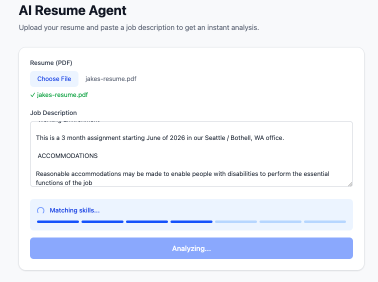
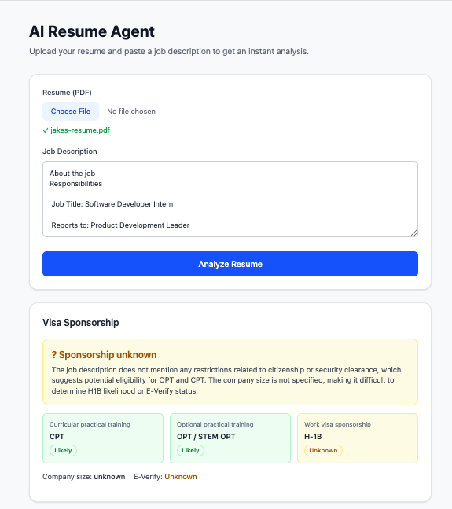
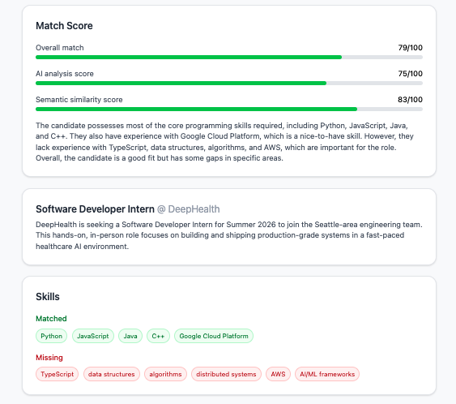
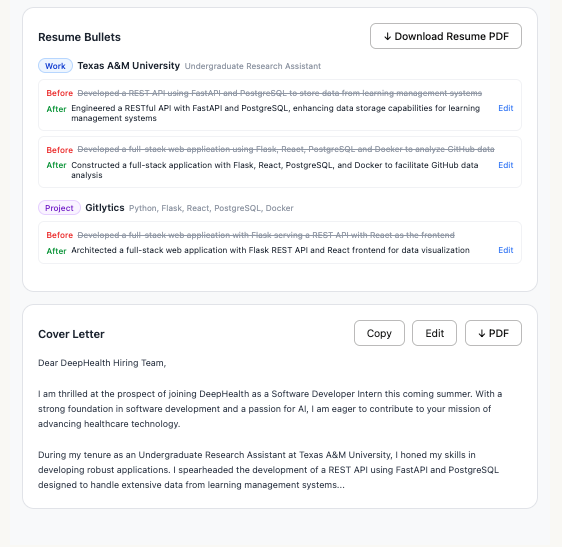

# AI Resume Agent

An AI-powered job application assistant built for international students on F-1 visas. Upload your resume PDF and paste a job description to get an instant, end-to-end analysis — from skill matching to a fully formatted LaTeX resume PDF.

## Demo
**Analysis Process**



**AI Resume Agent Results**






---

## Features

- **JD Analysis** — Extracts role requirements, required skills, and responsibilities
- **Match Score** — Combines semantic embedding similarity and GPT-4o analysis into a single score
- **Skill Gap Detection** — Shows matched vs. missing technical skills
- **Resume Rewriter** — Rewrites every bullet point grouped by job and project, with before/after diff view and inline editing
- **Cover Letter Generator** — Personalized cover letter with edit and PDF download support
- **Visa Sponsorship Detection** — Evaluates CPT, OPT/STEM OPT, and H-1B likelihood using keyword matching and LLM inference
- **LaTeX Resume PDF** — Generates a professionally formatted resume using Jake's Resume template, with auto-bolded metrics

---

## Tech Stack

| Layer | Technology |
|-------|------------|
| Frontend | React, TypeScript, Tailwind CSS |
| Backend | Node.js, Express |
| AI Orchestration | LangChain |
| AI Model | OpenAI GPT-4o |
| Embeddings | OpenAI text-embedding-3-small |
| PDF Parsing | pdf-parse |
| Resume Generation | LaTeX (pdflatex / TeX Live) |
| Streaming | SSE (Server-Sent Events) |

---

## Project Structure

```
ai-resume-agent/
├── backend/
│   ├── src/
│   │   ├── index.js                      # Server entry point
│   │   ├── routes/
│   │   │   ├── analyze.js                # Analysis API + SSE streaming
│   │   │   └── pdf.js                    # Resume & cover letter PDF endpoints
│   │   ├── latex/
│   │   │   └── template.tex              # Jake's Resume LaTeX template
│   │   └── services/
│   │       ├── pdfParser.js              # PDF → plain text
│   │       ├── embeddings.js             # Cosine similarity scoring
│   │       ├── resumeGenerator.js        # LaTeX template filling + compilation
│   │       └── pipeline/
│   │           ├── index.js              # Orchestrates all 6 steps
│   │           ├── parseJSON.js          # Strips markdown from GPT output
│   │           ├── resumeParser.js       # Step 1: Parse resume
│   │           ├── jdAnalyzer.js         # Step 2: Analyze JD
│   │           ├── skillMatcher.js       # Step 3: Match skills
│   │           ├── resumeRewriter.js     # Step 4: Rewrite bullets
│   │           ├── coverLetter.js        # Step 5: Generate cover letter
│   │           └── sponsorDetector.js    # Step 6: Visa sponsorship detection
│   └── .env                              # API keys (never committed)
│
├── frontend/
│   └── src/
│       └── App.tsx                       # Main UI
│
└── output/                               # Generated PDFs organized by application
    └── Google_SoftwareEngineer_2026-03-13/
        ├── resume.pdf
        └── cover_letter.pdf
```

---

## How It Works

```
User uploads PDF + pastes JD
        ↓
Extract plain text from PDF
        ↓
Step 1 — Resume Parser
  Extracts name, contact info, skills, work experience, projects, education
        ↓
Step 2 — JD Analyzer
  Extracts job title, company, required skills, nice-to-haves, responsibilities
        ↓
Step 3 — Skill Matcher
  · Embedding score: cosine similarity between resume and JD skill vectors
  · AI score: GPT-4o contextual comparison of matched skills and gaps
  · Final score = Embedding (50%) + AI (50%)
        ↓
Step 4 — Resume Rewriter
  Rewrites bullets grouped by experience and project
  Each bullet shows original vs. rewritten for comparison
        ↓
Step 5 — Cover Letter Generator
  Generates a personalized cover letter based on resume and JD
        ↓
Step 6 — Sponsor Detector
  Layer 1: Keyword matching (30+ sponsor / no-sponsor signal phrases)
  Layer 2: GPT-4o infers company size, E-Verify status, CPT/OPT/H-1B likelihood
        ↓
Progress streamed to frontend via SSE after each step
        ↓
User edits bullets and cover letter inline
        ↓
Download LaTeX-compiled resume PDF + cover letter PDF
Saved to output/Company_Title_Date/
```

---

## Visa Sponsorship Detection

Designed specifically for F-1 students evaluating three stages of work authorization:

| Stage | Description |
|-------|-------------|
| CPT | On-campus practical training during enrollment |
| OPT / STEM OPT | Post-graduation work authorization (12–36 months) |
| H-1B | Long-term work visa requiring annual lottery sponsorship |

**Red flag keywords** (triggers "Unlikely" verdict): `"US citizens only"`, `"no visa sponsorship"`, `"security clearance required"`, `"must be authorized to work without sponsorship"`, `"GC or citizen"`, `"TS/SCI"`, and 25+ more.

**Positive keywords** (triggers "Likely" verdict): `"visa sponsorship available"`, `"OPT accepted"`, `"CPT accepted"`, `"H-1B sponsorship"`, and more.

If no keywords are found, GPT-4o infers likelihood from company size, industry, and job context.

---

## Getting Started

### Prerequisites
- Node.js 18+
- OpenAI API key
- TeX Live / BasicTeX (for PDF compilation)

### Install BasicTeX (Mac)

Download BasicTeX.pkg from [tug.org/mactex](https://tug.org/mactex/mactex-download.html), then install required packages:

```bash
sudo tlmgr update --self
sudo tlmgr install preprint titlesec marvosym enumitem
```

### Run the backend

```bash
cd backend
npm install
npm run dev
```

### Run the frontend

```bash
cd frontend
npm install
npm run dev
```

Create a `backend/.env` file:

```
OPENAI_API_KEY=sk-your-key-here
PORT=3000
```

Frontend runs at `http://localhost:5173`, backend at `http://localhost:3000`.

---

## Roadmap

- [ ] Replace manual pipeline with LangGraph for conditional branching and node retries
- [ ] Integrate H-1B historical database lookup (h1bdata.info / myvisajobs.com)
- [ ] Deploy to production (Railway + Docker for backend, Vercel for frontend)
- [ ] Save and browse past analysis history
- [ ] Vector database (Chroma / Pinecone) for semantic job recommendations
